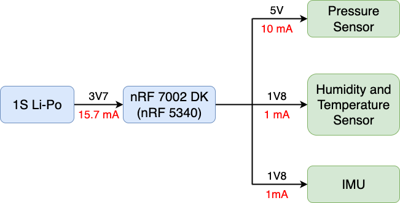
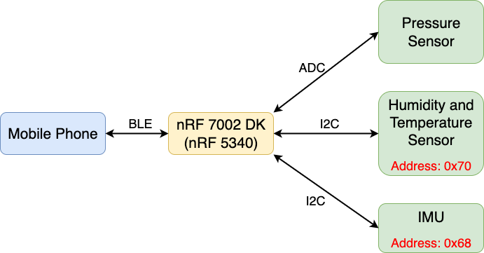

# IoT Venture Pitch
## ESE5180: IoT Wireless, Security, & Scaling

**Team Name: Mesh** 

| Team Member Name | Email Address       |
|------------------|---------------------|
| Zeng Li          |lizeng@seas.upenn.edu|
| Haichao Zhao         |haichao@seas.upenn.edu           |
| Yuner Zhang      |yunerzh@seas.upenn.edu|
| Xinyi Wang         |xinyi888@seas.upenn.edu           |

**GitHub Repository URL:https://github.com/ese5180/iot-venture-f25-mesh.git
## Concept Development

### Product Function

The smart mouthguard is a wireless-enabled nighttime dental appliance, which integrates multiple sensors to monitor bruxism, oral condition and sleep position changes.

### Target Market & Demographics

1. Who will be using your product?

**Primary Users:** Individuals suffering from bruxism, TMJ disorders, or sleep-related dental issues, representing about 8-10% of the adult population.

**Secondary Users:** Health-conscious consumers seeking comprehensive sleep tracking beyond wristbands or bedside monitors.

**Tertiary Users:** Researchers and clinical institutions conducting sleep studies or investigating oral-systemic health connections.

2. Who will be purchasing your product?

Dental patients(direct consumer purchase, often through dentists).

Dentists, orthodontists, and sleep specialists who provide the device as part of treatment packages.

Research institutions and hospitals purchasing in bulk for clinical studies.

3. Where in the world would you deploy your product?

Initial deployment: United States, due to high awareness of sleep health and strong dental appliance adoption.

Expansion market: Europe(Germany, UK, Scandinavia for high oral appliance use) and East Asia(China, South Korea, Japan), where bruxism and sleep disorders are rising.

4. How large is the market you're targeting, in US dollars?

The potential market for the smart mouthguard lies at the intersection of the bruxism treatment/management market and the broader sleep technology devices market.

**Bruxism Treatment/Management Market:**

Estimates vary depending on scope. For example, Coherent Market Insights reports a conservative global market size of USD 1.38 billion in 2025, with a CAGR of ~6.6% (2025–2032). Broader definitions of bruxism management, which include oral appliances and monitoring solutions, are valued higher: Future Market Insights projects USD 7.2 billion in 2025, growing to USD 14 billion by 2035 at ~6.9% CAGR. Similarly, Reanin estimates the global bruxism management market at USD 6.3 billion in 2024, expected to surpass USD 10 billion by 2031 (CAGR ~7.1%). Taken together, these reports suggest that the bruxism-related market should be conservatively considered a multi-billion-dollar industry.

**Sleep Technology Devices Market:**
This broader market is significantly larger and rapidly growing. Grand View Research valued the global sleep tracking devices market at USD 26.6 billion in 2023, projected to reach USD 58.2 billion by 2030 (CAGR ~11.7%). Maximize Market Research estimated USD 19.5 billion in 2024, with forecasts of ~USD 56 billion by 2032 (CAGR ~14.9%). Precedence Research reports USD 24.9 billion in 2024, with expected growth to USD 134.6 billion by 2034 (CAGR ~18.5%). These consistent estimates position sleep technology devices as a tens-of-billions-dollar market with strong growth momentum.

**Conclusion:**

Based on industry data, the target market size for the smart mouthguard can be credibly positioned as a multi-billion-dollar opportunity, grounded in the overlap between bruxism treatment and sleep technology markets. Therefore, we conservatively estimates the traget market size will be 5 billions.

5. How much of that market do you expect to capture, in US dollars?

In the early commercialization stage, we adopt a conservative assumption of capturing only 0.1% of the global sleep technology devices market (≈ USD 5 billion). This results in an estimated annual revenue of approximately USD 5 million within 3–5 years. Such a figure is realistic for an early-stage IoT healthcare device, reflecting the time required for regulatory clearance, user adoption, and clinical validation.

Looking ahead, if clinical trials demonstrate reliability and physicians integrate the device into standard treatment pathways, our obtainable market share could expand toward 0.5–1% of the combined bruxism management and sleep technology markets (USD 20 billion). Under this scenario, annual revenues could exceed USD 100 million, driven by adoption across both consumer wellness channels and medical/dental professional networks.

6. What competitors are ready in the space.

**GrindRelief Pro / traditional night guards** – provide protection but no data tracking.

**Fitbit / Oura Ring / WHOOP** – track sleep but lack oral health integration.

**SomnoDent / ProSomnus** – FDA-cleared oral appliances for sleep apnea, but not designed for multi-sensor monitoring.

Our differentiator: multi-modal oral cavity sensing + wireless data integration, uniquely combining protection, monitoring, and analytics.

### Stakeholders

Based on the above market analysis, key stakeholders include:

**End users (patients with bruxism, TMJ, or sleep disorders):** They validate usability, comfort, and willingness to adopt a mouth-based wearable.

**Dentists, orthodontists, and sleep specialists:** They act as prescribers and distribution partners, and need reliable data integration into clinical workflows.

**Healthcare institutions & research centers:** Potential early adopters for clinical trials, validating accuracy and expanding medical credibility.

**Regulatory advisors (FDA consultants, dental device compliance experts):** To ensure device clearance as a medical/dental appliance.

**Health-conscious consumers interested in advanced personal health monitoring:** They represent an early adopter group outside the patient population, validating consumer desirability and driving awareness in the wellness market.

We have already identified potential stakeholder directions: for example, **Edward Steager** in GRASP Lab is interested in advanced personal oral health monitoring. Professor **Pamela Z. Cacchione** in Penn Nursing is also interested in our idea, especially in the aspect of detecting sleep disorder. Professor **Kyle Vining** in school of dental medicine also considers our project to be very promising.

### System-Level Diagrams

#### **Device Block Diagram**

#### **Communication Diagram**

### Security Requirements Specification

#### **Overview**

This section describes the security systems required for the smart dental brace project, which collects sensitive biometric data including bite force, oral temperature/humidity, and head posture through embedded sensors. The system transmits this health data via Bluetooth LE to external devices for analysis and storage.

#### **Definitions, Abbreviations**

**PHI** - Protected Health Information  

**BLE** - Bluetooth Low Energy  

**AES** - Advanced Encryption Standard 

**OTP** - One-Time Programmable memory

**IEC 62304** - International standard for medical device software lifecycle processes

**FDA** - Food and Drug Administration (US medical device regulatory body)

#### **Functionality**

**SEC 01 –** Biometric data (bite force, temperature, humidity, IMU readings) shall be encrypted using AES-128 or higher before wireless transmission

**SEC 02 –** All cryptographic keys and device credentials shall be stored in the nRF5340's secure OTP memory region with hardware-level protection

**SEC 03 –** The BLE connection shall implement authentication and authorization before allowing access to sensitive health data

**SEC 04 –** The device shall implement secure boot functionality to prevent unauthorized firmware modifications

**SEC 05 –** The system shall comply with medical device security standards (IEC 62304, FDA cybersecurity guidelines)

### Hardware Requirements Specification

#### **Overview**

The system hardware consists of a low-power microcontroller, multiple sensors for pressure, temperature, humidity, and an IMU for motion detection, along with a power management unit with a rechargeable battery. These hardware modules are integrated to support real-time monitoring and reliable data transmission.

#### **Definitions, Abbreviations**

**SoC** - System on Chip 

**BLE** - Bluetooth Low Energy  

**I2C** - Inter-Integrated Circuit (communication bus)

**IMU** - Inertial Measurement Unit

**RH** - Relative Humidity

**Bruxism** - Teeth grinding or clenching during sleep

#### **Functionality**

**HRS 01 – Core Microcontroller.** The system shall utilize a low-power SoC with integrated BLE for device pairing, data synchronization, and multiple interfaces (I2C) to connect with sensors and peripheral modules.

**HRS 02 – Oral Pressure Sensor.** A high-sensitivity pressure sensor shall detect bite force and occlusion changes to identify bruxism events and record data when thresholds are exceeded. The sensor shall communicate with the microcontroller via the I2C bus.

**HRS 03 – Oral Temperature and Humidity Sensor.** The system shall monitor intraoral temperature within 30°C–40°C and humidity within 70%–100% RH for health and comfort analysis. The sensor shall communicate with the microcontroller via the I2C bus.

**HRS 04 – IMU Sensor.** A six-axis IMU shall track head movements and sleep posture, supporting sleep quality analysis and detection of abnormal behaviors. The sensor shall communicate with the microcontroller via the I2C bus.

**HRS 05 – Power Management.** The system shall feature low-power design with a rechargeable battery for extended standby and overnight operation.

**HRS 06 – Structure and Materials.** The device shall use biocompatible, medical-grade materials with moisture and corrosion resistance for safe, durable intraoral use.

### Software Requirements Specification
#### **Overview**
The smart dental appliance software collects data from multiple onboard sensors (pressure, humidity/temperature, IMU), processes and stores it locally, and transfers data securely via Bluetooth Low Energy (BLE) to a mobile application. The mobile application displays both real-time and historical data, generates basic usage reports (such as bruxism event statistics and sleep condition changes), and synchronizes information with cloud storage when available.

#### **Users**

**General Consumers** – Individuals using the device at home for personal monitoring of nighttime bruxism, oral conditions, and sleep-related changes.   
**Clinical Researchers and Medical Professionals** –  Users analyzing aggregated reports or exporting data for further research and treatment evaluation. 

#### **Definitions, Abbreviations**

**BLE** – Bluetooth Low Energy, a low-power wireless communication standard.  
**IMU** – Inertial Measurement Unit, a sensor for acceleration and motion data.  
**Offline cache** – Temporary local storage of sensor data when wireless connection is unavailable.  

#### **Functionality**
**SRS 01** – The system shall interface with the BMI270 IMU via the I²C bus to acquire 3-axis accelerometer and 3-axis gyroscope data, with a configurable sampling rate between 25 Hz and 200 Hz.  
**SRS 02** – The system shall read the pressure sensor via I²C at a sampling rate of 50–200 Hz to detect bruxism-related pressure changes. It shall record peak force, duration, and event counts, and generate logs for bruxism event analysis.  
**SRS 03** – The system shall access the temperature and humidity sensor via I²C with a configurable sampling rate between 0.1 Hz and 1 Hz, providing at least ±0.5 °C temperature accuracy and ±2 %RH humidity accuracy.  
**SRS 04** – The system shall guarantee that real-time sensor data is displayed on the mobile application with an end-to-end latency of **≤ 1 second**.  
**SRS 05** – The system shall provide offline data caching for at least **5 days** of usage when no wireless connection is available.  

