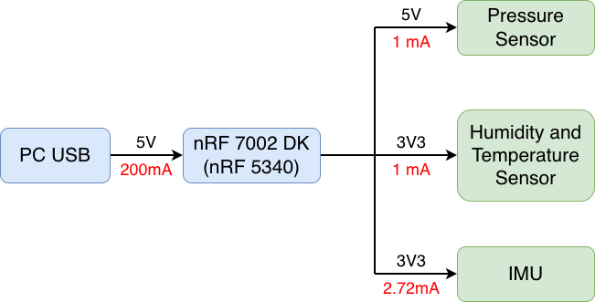
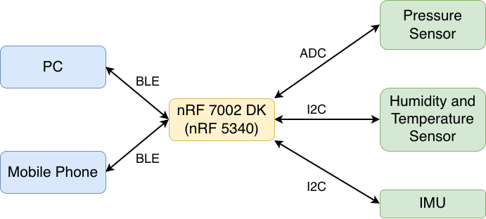

[](https://classroom.github.com/a/9GQ6o4cu)
# IoT Venture Pitch
## ESE5180: IoT Wireless, Security, & Scaling

**Team Name: Mesh** 

| Team Member Name | Email Address       |
|------------------|---------------------|
| Zeng Li          |lizeng@seas.upenn.edu|
| Haichao Zhao         |haichao@seas.upenn.edu           |
| Yuner Zhang      |yunerzh@seas.upenn.edu|
| Xinyi Wang         |xinyi888@seas.upenn.edu           |

**GitHub Repository URL:https://github.com/ese5180/iot-venture-f25-mesh.git
## Concept Development

### Product Function

The smart mouthguard is a wireless-enabled nighttime dental appliance, which integrates multiple sensors to monitor bruxism, oral condition and sleep position changes.

### Target Market & Demographics

1. Who will be using your product?

**Primary Users:** Individuals suffering from bruxism, TMJ disorders, or sleep-related dental issues, representing about 8-10% of the adult population.

**Secondary Users:** Health-conscious consumers seeking comprehensive sleep tracking beyond wristbands or bedside monitors.

**Tertiary Users:** Researchers and clinical institutions conducting sleep studies or investigating oral-systemic health connections.

2. Who will be purchasing your product?

Dental patients(direct consumer purchase, often through dentists).

Dentists, orthodontists, and sleep specialists who provide the device as part of treatment packages.

Research institutions and hospitals purchasing in bulk for clinical studies.

3. Where in the world would you deploy your product?

Initial deployment: United States, due to high awareness of sleep health and strong dental appliance adoption.

Expansion market: Europe(Germany, UK, Scandinavia for high oral appliance use) and East Asia(China, South Korea, Japan), where bruxism and sleep disorders are rising.

4. How large is the market you're targeting, in US dollars?

The potential market for the smart mouthguard lies at the intersection of the bruxism treatment/management market and the broader sleep technology devices market.

**Bruxism Treatment/Management Market:**

Estimates vary depending on scope. For example, Coherent Market Insights reports a conservative global market size of USD 1.38 billion in 2025, with a CAGR of ~6.6% (2025–2032). Broader definitions of bruxism management, which include oral appliances and monitoring solutions, are valued higher: Future Market Insights projects USD 7.2 billion in 2025, growing to USD 14 billion by 2035 at ~6.9% CAGR. Similarly, Reanin estimates the global bruxism management market at USD 6.3 billion in 2024, expected to surpass USD 10 billion by 2031 (CAGR ~7.1%). Taken together, these reports suggest that the bruxism-related market should be conservatively considered a multi-billion-dollar industry.

**Sleep Technology Devices Market:**
This broader market is significantly larger and rapidly growing. Grand View Research valued the global sleep tracking devices market at USD 26.6 billion in 2023, projected to reach USD 58.2 billion by 2030 (CAGR ~11.7%). Maximize Market Research estimated USD 19.5 billion in 2024, with forecasts of ~USD 56 billion by 2032 (CAGR ~14.9%). Precedence Research reports USD 24.9 billion in 2024, with expected growth to USD 134.6 billion by 2034 (CAGR ~18.5%). These consistent estimates position sleep technology devices as a tens-of-billions-dollar market with strong growth momentum.

**Conclusion:**

Based on industry data, the target market size for the smart mouthguard can be credibly positioned as a multi-billion-dollar opportunity, grounded in the overlap between bruxism treatment and sleep technology markets. Therefore, we conservatively estimates the traget market size will be 5 billions.

5. How much of that market do you expect to capture, in US dollars?

In the early commercialization stage, we adopt a conservative assumption of capturing only 0.1% of the global sleep technology devices market (≈ USD 5 billion). This results in an estimated annual revenue of approximately USD 5 million within 3–5 years. Such a figure is realistic for an early-stage IoT healthcare device, reflecting the time required for regulatory clearance, user adoption, and clinical validation.

Looking ahead, if clinical trials demonstrate reliability and physicians integrate the device into standard treatment pathways, our obtainable market share could expand toward 0.5–1% of the combined bruxism management and sleep technology markets (USD 20 billion). Under this scenario, annual revenues could exceed USD 100 million, driven by adoption across both consumer wellness channels and medical/dental professional networks.

6. What competitors are ready in the space.

**GrindRelief Pro / traditional night guards** – provide protection but no data tracking.

**Fitbit / Oura Ring / WHOOP** – track sleep but lack oral health integration.

**SomnoDent / ProSomnus** – FDA-cleared oral appliances for sleep apnea, but not designed for multi-sensor monitoring.

Our differentiator: multi-modal oral cavity sensing + wireless data integration, uniquely combining protection, monitoring, and analytics.

### Stakeholders

Based on the above market analysis, key stakeholders include:

**End users (patients with bruxism, TMJ, or sleep disorders):** They validate usability, comfort, and willingness to adopt a mouth-based wearable.

**Dentists, orthodontists, and sleep specialists:** They act as prescribers and distribution partners, and need reliable data integration into clinical workflows.

**Healthcare institutions & research centers:** Potential early adopters for clinical trials, validating accuracy and expanding medical credibility.

**Regulatory advisors (FDA consultants, dental device compliance experts):** To ensure device clearance as a medical/dental appliance.

**Health-conscious consumers interested in advanced personal health monitoring:** They represent an early adopter group outside the patient population, validating consumer desirability and driving awareness in the wellness market.

We have already identified potential stakeholder directions: for example, **Edward Steager** in GRASP Lab is interested in advanced personal oral health monitoring. Professor **Pamela Z. Cacchione** in Penn Nursing is also interested in our idea, especially in the aspect of detecting sleep disorder. Professor **Kyle Vining** in school of dental medicine also considers our project to be very promising.

### System-Level Diagrams

#### **Device Block Diagram**
<div align="center">

</div>

#### **Communication Diagram**
<div align="center">

</div>

### Security Requirements Specification

#### **Overview**

This section describes the security systems required for the smart dental brace project, which collects sensitive biometric data including bite force, oral temperature/humidity, and head posture through embedded sensors. The system transmits this health data via Bluetooth LE to external devices for analysis and storage.

#### **Definitions, Abbreviations**

**PHI** - Protected Health Information  

**BLE** - Bluetooth Low Energy  

**AES** - Advanced Encryption Standard 

**OTP** - One-Time Programmable memory

**IEC 62304** - International standard for medical device software lifecycle processes

**FDA** - Food and Drug Administration (US medical device regulatory body)

#### **Functionality**

**SEC 01 –** Biometric data (bite force, temperature, humidity, IMU readings) shall be encrypted using AES-128 or higher before wireless transmission

**SEC 02 –** All cryptographic keys and device credentials shall be stored in the nRF5340's secure OTP memory region with hardware-level protection

**SEC 03 –** The BLE connection shall implement authentication and authorization before allowing access to sensitive health data

**SEC 04 –** The device shall implement secure boot functionality to prevent unauthorized firmware modifications

**SEC 05 –** The system shall comply with medical device security standards (IEC 62304, FDA cybersecurity guidelines)


### Hardware Requirements Specification

#### **Overview**

The system hardware consists of a low-power microcontroller, multiple sensors for pressure, temperature, humidity, and an IMU for motion detection, along with a power management unit with a rechargeable battery. These hardware modules are integrated to support real-time monitoring and reliable data transmission.

#### **Definitions, Abbreviations**

**SoC** - System on Chip 

**BLE** - Bluetooth Low Energy  

**I2C** - Inter-Integrated Circuit (communication bus)

**IMU** - Inertial Measurement Unit

**RH** - Relative Humidity

**Bruxism** - Teeth grinding or clenching during sleep

#### **Functionality**

**HRS 01 – Core Microcontroller.** The system shall utilize a low-power SoC with integrated BLE for device pairing, data synchronization, and multiple interfaces (I2C) to connect with sensors and peripheral modules.

**HRS 02 – Oral Pressure Sensor.** A high-sensitivity pressure sensor shall detect bite force and occlusion changes to identify bruxism events and record data when thresholds are exceeded. The sensor shall communicate with the microcontroller via the I2C bus.

**HRS 03 – Oral Temperature and Humidity Sensor.** The system shall monitor intraoral temperature within 30°C–40°C and humidity within 70%–100% RH for health and comfort analysis. The sensor shall communicate with the microcontroller via the I2C bus.

**HRS 04 – IMU Sensor.** A six-axis IMU shall track head movements and sleep posture, supporting sleep quality analysis and detection of abnormal behaviors. The sensor shall communicate with the microcontroller via the I2C bus.

**HRS 05 – Power Management.** The system shall feature low-power design with a rechargeable battery for extended standby and overnight operation.

**HRS 06 – Structure and Materials.** The device shall use biocompatible, medical-grade materials with moisture and corrosion resistance for safe, durable intraoral use.

### Software Requirements Specification
#### **Overview**
The smart dental appliance software collects data from multiple onboard sensors (pressure, humidity/temperature, IMU), processes and stores it locally, and transfers data securely via Bluetooth Low Energy (BLE) to a mobile application. The mobile application displays both real-time and historical data, generates basic usage reports (such as bruxism event statistics and sleep condition changes), and synchronizes information with cloud storage when available.


#### **Users**

**General Consumers** – Individuals using the device at home for personal monitoring of nighttime bruxism, oral conditions, and sleep-related changes.   
**Clinical Researchers and Medical Professionals** –  Users analyzing aggregated reports or exporting data for further research and treatment evaluation. 

#### **Definitions, Abbreviations**

**BLE** – Bluetooth Low Energy, a low-power wireless communication standard.  
**IMU** – Inertial Measurement Unit, a sensor for acceleration and motion data.  
**Offline cache** – Temporary local storage of sensor data when wireless connection is unavailable.  


#### **Functionality**
**SRS 01** – The system shall interface with the BMI270 IMU via the I²C bus to acquire 3-axis accelerometer and 3-axis gyroscope data, with a configurable sampling rate between 25 Hz and 200 Hz.  
**SRS 02** – The system shall read the pressure sensor via I²C at a sampling rate of 50–200 Hz to detect bruxism-related pressure changes. It shall record peak force, duration, and event counts, and generate logs for bruxism event analysis.  
**SRS 03** – The system shall access the temperature and humidity sensor via I²C with a configurable sampling rate between 0.1 Hz and 1 Hz, providing at least ±0.5 °C temperature accuracy and ±2 %RH humidity accuracy.  
**SRS 04** – The system shall guarantee that real-time sensor data is displayed on the mobile application with an end-to-end latency of ≤ 1 second.  
**SRS 05** – The system shall provide offline data caching for at least 5 days of usage when no wireless connection is available.  

# Assignment 3.5: Secure Firmware Updates - Smart Retainer Project

## Table of Contents
- Overview
- Part 3.5.1: Bootloading Process Description
- Part 3.5.2: Implementation
- Part 3.5.3: Demonstration
- Build and Flash Instructions
- Testing FOTA Updates
- Troubleshooting

## Overview

This section describes the implementation of Secure Firmware Over-The-Air (FOTA) updates for the Smart Retainer IoT device using:

- **Hardware:** nRF7002 DK (nRF5340 SoC)
- **Wireless:** Bluetooth Low Energy (BLE)
- **Bootloader:** MCUboot with ECDSA-P256 signing
- **External Storage:** MX25R64 QSPI NOR Flash (8MB)

## Part 3.5.1: Bootloading Process Description

### Architecture Diagram

```
┌─────────────────────────────────────────────────────────────────┐
│ nRF5340 Flash Memory Map                                        │
├─────────────────────────────────────────────────────────────────┤
│ 0x00000000 ┌──────────────────────────────────────────┐         │
│            │ MCUboot Bootloader                       │         │
│            │ Size: ~48 KB                             │         │
│            │ - Signature verification                 │         │
│            │ - Image validation                       │         │
│ 0x0000C000 ├──────────────────────────────────────────┤         │
│            │ Primary Slot (Slot 0)                    │         │
│            │ Size: ~460 KB                            │         │
│            │ - Active Application Code                │         │
│            │ - Smart Retainer Firmware                │         │
│ 0x00080000 └──────────────────────────────────────────┘         │
│            ▼                                                     │
│            Internal Flash End                                   │
└─────────────────────────────────────────────────────────────────┘

┌─────────────────────────────────────────────────────────────────┐
│ External Flash (MX25R64 - 8MB)                                  │
├─────────────────────────────────────────────────────────────────┤
│ 0x00000000 ┌──────────────────────────────────────────┐         │
│            │ Secondary Slot (Slot 1)                  │         │
│            │ Size: ~460 KB                            │         │
│            │ - Firmware Update Storage                │         │
│            │ - Downloaded via BLE                     │         │
│ 0x00074000 ├──────────────────────────────────────────┤         │
│            │ Available Space                          │         │
│            │ ~7.5 MB for future use                   │         │
│            │ (Logs, calibration data, etc.)           │         │
└─────────────────────────────────────────────────────────────────┘
```

### Boot Flow Diagram

```
Power On / Reset
      │
      ▼
┌─────────────────┐
│ MCUboot Starts  │
│ @ 0x00000000    │
└────────┬────────┘
         │
         ▼
    ┌────────────────────┐
    │ Check Slot 1       │
    │ (External Flash)   │
    │ for New Image?     │
    └─────┬──────────────┘
          │
    Yes ──┼── No
          │  │
          │  └─────────────────┐
          │                    │
          ▼                    │
    ┌──────────────────┐       │
    │ Verify Signature │       │
    │ (ECDSA-P256)     │       │
    └────┬─────────────┘       │
         │                     │
    Valid│ Invalid             │
         │  │                  │
         │  ▼                  │
         │  [Reject]           │
         │                     │
         ▼                     │
    ┌──────────────────┐       │
    │ Swap Images      │       │
    │ Slot1 → Slot0    │       │
    └────┬─────────────┘       │
         │                     │
    ─────┼─────────────────────┘
         │
         ▼
    ┌──────────────────┐
    │ Validate Slot 0  │
    │ (Primary Image)  │
    └────┬─────────────┘
         │
    Valid│ Invalid
         │  │
         │  ▼
         │  [Boot Failed]
         │
         ▼
    ┌──────────────────┐
    │ Boot into        │
    │ Application      │
    │ @ 0x0000C000     │
    └────────┬─────────┘
             │
             ▼
    ┌──────────────────┐
    │ Smart Retainer   │
    │ Application      │
    │ - BLE Service    │
    │ - IMU Monitoring │
    │ - FOTA Ready     │
    └──────────────────┘
```

### Questions Answered

#### 1. How large is your bootloader?

**~48 KB (49,152 bytes)**

The MCUboot bootloader occupies approximately 48 KB of flash memory, from address 0x00000000 to 0x0000C000. This includes:

- Boot logic and image management
- ECDSA-P256 signature verification code
- QSPI driver for external flash access
- Minimal logging infrastructure

#### 2. How large is your existing application code?

**~460 KB (470,016 bytes)**

The Smart Retainer application (Primary Slot) occupies approximately 460 KB, from 0x0000C000 to 0x00080000. This includes:

- Zephyr RTOS kernel
- BLE stack with custom IMU service
- BNO055 IMU driver with quaternion processing
- MCUmgr protocol for FOTA
- Orientation offset calibration system
- Application logic

**Note:** With external flash, we can support much larger applications (up to 7+ MB if needed).

#### 3. Does the bootloader or application code handle the firmware image download?

**The APPLICATION CODE handles the firmware download.**

**Reasoning:**

**MCUboot (bootloader)** is responsible for:
- Verifying signatures
- Swapping images between slots
- Booting into the validated application

**Application (Smart Retainer firmware)** is responsible for:
- Receiving firmware updates over BLE
- Writing the new image to Secondary Slot (external flash)
- Triggering reboot for MCUboot to perform the swap

This separation of concerns means:
- The bootloader stays minimal and secure
- The application can use its full networking stack (BLE)
- Updates happen while the device is operational

#### 4. What wireless communication is used to download images?

**Bluetooth Low Energy (BLE) using MCUmgr SMP Protocol**

**Protocol Stack:**

```
┌──────────────────────────────────────┐
│ Mobile App / nRF Connect / mcumgr    │ ← User Interface
├──────────────────────────────────────┤
│ SMP (Simple Management Protocol)     │ ← MCUmgr Protocol
├──────────────────────────────────────┤
│ GATT (Generic Attribute Profile)     │ ← BLE Service Layer
├──────────────────────────────────────┤
│ BLE L2CAP (Logical Link Control)     │ ← BLE Transport
├──────────────────────────────────────┤
│ BLE Radio (2.4 GHz)                  │ ← Physical Layer
└──────────────────────────────────────┘
```

**Why BLE was chosen:**

1. **Already integrated:** The Smart Retainer uses BLE for IMU data streaming
2. **Low power:** BLE is energy-efficient for battery-operated wearables
3. **Short range:** Suitable for user-device interactions (1-10 meters)
4. **Mobile app friendly:** Easy to integrate with iOS/Android apps
5. **MCUmgr support:** Nordic's nRF Connect SDK has excellent BLE MCUmgr integration

**Alternative protocols considered:**

- **Wi-Fi:** Not suitable - device doesn't have Wi-Fi (only BLE on nRF5340)
- **LoRa:** Not suitable - extremely slow data rate (would take hours to download 460KB)
- **Cellular:** Not suitable - no cellular modem, higher power consumption

#### 5. Where are the downloaded firmware images stored?

**External QSPI NOR Flash (MX25R64) - Secondary Slot**

**Storage Details:**

- **Flash Chip:** Macronix MX25R64 (64 Mbit / 8 MB)
- **Interface:** QSPI (Quad-SPI) for high-speed access
- **Address Range:** 0x00000000 - 0x00074000 for Secondary Slot (~460 KB)
- **Remaining Space:** ~7.5 MB available for logs, calibration profiles, etc.

**Why external flash:**

1. **Limited internal flash:** nRF5340 has only 1MB total flash
   - Without external flash, we'd need to sacrifice ~460KB for secondary slot
   - This would severely limit application size
2. **Non-volatile:** Firmware survives power cycles
3. **Fast access:** QSPI provides sufficient speed for image verification
4. **Low cost:** MX25R64 is inexpensive (~$0.50 in volume)

**Access Pattern:**

```
Application receives BLE packets
         ↓
MCUmgr processes chunks
         ↓
Writes to External Flash via QSPI
         ↓
Full image stored in Slot 1
         ↓
Application triggers reboot
         ↓
MCUboot verifies & swaps
```

#### 6. What features have you enabled to handle firmware update failures?

##### a) Signature Verification (ECDSA-P256)

- **Feature:** All firmware images must be cryptographically signed
- **Failure Mode:** Invalid signature → Image rejected, boot continues with old firmware
- **Configuration:** `SB_CONFIG_BOOT_SIGNATURE_TYPE_ECDSA_P256=y`

##### b) Image Validation

- **Feature:** MCUboot validates image header, checksums, and magic numbers
- **Failure Mode:** Corrupted image → Rejected before swap
- **Configuration:** `CONFIG_BOOT_VALIDATE_SLOT0=y`

##### c) Swap Revert on Boot Failure

- **Feature:** If new firmware fails to boot, MCUboot reverts to previous version
- **Mechanism:**
  - New image boots with "test" flag
  - Application must call `img_mgmt_state_confirm()` to mark as permanent
  - If device resets before confirmation, MCUboot reverts
- **Configuration:** Enabled by default in dual-slot mode

##### d) Slot 0 Validation on Every Boot

- **Feature:** Primary slot is validated before each boot
- **Failure Mode:** If Slot 0 becomes corrupted, device enters safe mode
- **Configuration:** `CONFIG_BOOT_VALIDATE_SLOT0=y`

##### e) Corrupted Download Detection

- **Feature:** MCUmgr uses checksums for each packet
- **Failure Mode:** Corrupted packet → Retransmission requested
- **Configuration:** Built into MCUmgr protocol

##### f) Optional: Serial Recovery Mode (Extra Credit)

- **Feature:** UART-based firmware recovery if all else fails
- **Activation:** Hold button during boot
- **Configuration:** Commented out in `sysbuild/mcuboot.conf`

To enable:

```
CONFIG_MCUBOOT_SERIAL=y
CONFIG_BOOT_SERIAL_UART=y
CONFIG_UART_CONSOLE=n
CONFIG_MCUBOOT_INDICATION_LED=y
```

##### g) Watchdog Protection (Optional)

- **Feature:** Can enable watchdog to detect boot hangs
- **Failure Mode:** If boot takes too long, watchdog resets device
- **Configuration:** `CONFIG_BOOT_WATCHDOG_FEED=y` (commented out)

##### Summary Table:

| Failure Scenario | Protection Mechanism | Result |
|-----------------|---------------------|---------|
| Invalid signature | ECDSA verification | Update rejected, old firmware runs |
| Corrupted download | Packet checksums | Retransmission requested |
| Corrupted image file | Header validation | Update rejected before swap |
| New firmware crashes | Swap revert | Automatic rollback to old version |
| Slot 0 corruption | Boot validation | Device enters safe mode / serial recovery |
| Complete brick | Serial recovery (UART) | Manual recovery via USB-UART |

## Part 3.5.2: Implementation

### File Structure

```
smart-retainer-fota/
├── prj.conf                              # Main application config (with FOTA)
├── sysbuild.conf                         # Build system config (MCUboot settings)
├── nrf7002dk_nrf5340_cpuapp.overlay      # Device tree overlay (external flash)
├── mcuboot_private_key.pem               # Private key for signing (GENERATE THIS!)
├── sysbuild/
│   ├── mcuboot.conf                      # MCUboot-specific config
│   └── mcuboot/
│       └── boards/
│           └── nrf7002dk_nrf5340_cpuapp.overlay  # MCUboot overlay
├── src/
│   ├── main.c
│   ├── ble_imu_service.c
│   ├── bno055_driver.c
│   └── orientation_offset.c
└── README.md                             # This file
```

### Key Configuration Changes

#### 1. prj.conf - Application Configuration

Added:

- **Flash subsystem:** `CONFIG_FLASH=y`, `CONFIG_FLASH_MAP=y`, `CONFIG_STREAM_FLASH=y`
- **Image manager:** `CONFIG_IMG_MANAGER=y`
- **External flash:** `CONFIG_NORDIC_QSPI_NOR=y`
- **MCUmgr:** `CONFIG_MCUMGR=y`, `CONFIG_MCUMGR_GRP_IMG=y`
- **BLE transport:** `CONFIG_MCUMGR_TRANSPORT_BT=y`
- **Dependencies:** `CONFIG_NET_BUF=y`, `CONFIG_ZCBOR=y`, `CONFIG_CRC=y`

#### 2. sysbuild.conf - Build System Configuration

Added:

- **Dual-slot mode:** `SB_CONFIG_MCUBOOT_MODE_SINGLE_APP=n`
- **Signature key:** `SB_CONFIG_BOOT_SIGNATURE_KEY_FILE="${APP_DIR}/mcuboot_private_key.pem"`
- **Signature type:** `SB_CONFIG_BOOT_SIGNATURE_TYPE_ECDSA_P256=y`
- **External flash secondary:** `SB_CONFIG_PM_EXTERNAL_FLASH_MCUBOOT_SECONDARY=y`

#### 3. Device Tree Overlays

Added:

- **External flash node:** `&mx25r64 { status = "okay"; };`
- **Partition manager config:** `nordic,pm-ext-flash = &mx25r64;`
- Both application and MCUboot overlays configured

## Part 3.5.3: Testing FOTA Updates

### Method 1: Using nRF Connect Mobile App

#### Prepare Update Package

1. **Make a trivial change to code** (so you can see it worked)

```c
// In main.c, change version string
#define FIRMWARE_VERSION "v1.0.1"  // Was v1.0.0

// Or add a log message
LOG_INF("🎉 FIRMWARE UPDATED TO v1.0.1!");
```

2. **Rebuild**

```bash
west build -b nrf7002dk/nrf5340/cpuapp --sysbuild
```

3. **Find update file**

```bash
# The update package is here:
build/zephyr/app_update.bin

# Or signed binary:
build/zephyr/zephyr.signed.bin
```

4. **Transfer to phone**

```bash
# Copy to your phone via:
# - AirDrop (iOS)
# - Google Drive
# - Email to yourself
# - USB cable
```

#### Perform FOTA Update

1. **Install nRF Connect app**
   - iOS: https://apps.apple.com/app/nrf-connect-mobile/id1054362403
   - Android: https://play.google.com/store/apps/details?id=no.nordicsemi.android.mcp

2. **Connect to device**
   - Open nRF Connect
   - Scan for devices
   - Find "SmartRetainer"
   - Tap "CONNECT"

3. **Enter DFU mode**
   - Tap three-dot menu (⋮)
   - Select "Device Firmware Update (DFU)"

4. **Upload firmware**
   - Tap "Select file"
   - Choose `app_update.bin` from step 3-4 above
   - Tap "START"

5. **Monitor progress**

```
Uploading: 0%
Uploading: 25%
Uploading: 50%
Uploading: 75%
Uploading: 100%
Validating...
Rebooting...
```

6. **Verify update**
   - Device will reboot automatically
   - Reconnect to see new version
   - Check logs for your changes

## Troubleshooting

### Issue: "Failed to generate signed image"

**Cause:** Missing or invalid private key

**Solution:**

```bash
# Generate key
imgtool keygen -k mcuboot_private_key.pem -t ecdsa-p256

# Verify it exists
ls -lh mcuboot_private_key.pem

# Check sysbuild.conf points to correct path
grep SIGNATURE_KEY_FILE sysbuild.conf
```

### Issue: "External flash not found"

**Cause:** QSPI driver not enabled or hardware issue

**Solution:**

```bash
# Check overlay includes external flash
grep mx25r64 nrf7002dk_nrf5340_cpuapp.overlay

# Check config enables QSPI
grep NORDIC_QSPI prj.conf

# Verify hardware connections (QSPI is on-board for nRF7002 DK)
```

### Issue: "Image upload fails at X%"

**Cause:** BLE buffer overflow or connection issues

**Solution:**

```c
// In prj.conf, increase buffers:
CONFIG_BT_BUF_ACL_TX_COUNT=8
CONFIG_BT_BUF_ACL_RX_COUNT=8
CONFIG_MCUMGR_BUF_COUNT=4
CONFIG_MCUMGR_TRANSPORT_NETBUF_COUNT=4

// Also ensure heap is large enough:
CONFIG_HEAP_MEM_POOL_SIZE=32768
```

### Issue: "Device reboots but old firmware still running"

**Cause:** Swap didn't occur (signature validation failed?)

**Solution:**

```bash
# Check MCUboot logs for signature errors
# Verify key used for signing matches key in bootloader
# Re-flash everything to ensure consistency
west flash --erase
```

### Issue: "Bootloader doesn't start"

**Cause:** Corrupted flash or missing bootloader

**Solution:**

```bash
# Erase everything and reflash
nrfjprog --eraseall
west flash
```

### Issue: "Out of memory (ENOMEM) during upload"

**Cause:** Insufficient heap for FOTA buffers

**Solution:**

```c
// In prj.conf:
CONFIG_HEAP_MEM_POOL_SIZE=65536  // Increase to 64KB
CONFIG_SYSTEM_WORKQUEUE_STACK_SIZE=8192
CONFIG_MAIN_STACK_SIZE=8192
```

## Security Considerations

### Key Management

- **Private key** (`mcuboot_private_key.pem`) must be kept secret
- In production:
  - Use Hardware Security Module (HSM)
  - Implement key rotation
  - Use separate keys for dev/prod

### Signature Verification

- ECDSA-P256 provides 128-bit security
- All images verified before boot
- Invalid signatures result in boot failure

### Secure Boot Chain

Hardware → MCUboot (signed) → Application (signed) → User Code

### Rollback Protection

- Firmware version downgrade attacks prevented
- Security version counter in image header
- Device can be configured to reject older versions

### Encrypted Images (Not Implemented)

- MCUboot supports AES-encrypted images
- Prevents firmware extraction
- Requires additional configuration

## Performance Metrics

### FOTA Update Time

- **Image Size:** ~460 KB
- **BLE Transfer Speed:** ~10-15 KB/s
- **Upload Time:** ~30-45 seconds
- **Verification Time:** ~2-3 seconds
- **Swap Time:** ~5-8 seconds
- **Total Time:** ~40-60 seconds

### Power Consumption During FOTA

- **Idle:** ~3 mA
- **BLE active:** ~8-12 mA
- **Flash write:** ~15-20 mA
- **Average during FOTA:** ~12-15 mA

### Flash Wear

- **QSPI flash endurance:** 100,000 cycles
- **Typical FOTA frequency:** Monthly
- **Expected lifetime:** >8,000 years

public class Cat extends Pet{

    private static String SOUND = "MEOW";

    private String type;

    public Cat(String name, int age, double weight, String type){

        super(name, age, weight);

        this.type = type;

    }

    static ArrayList<Integer> name = new ArrayList<> ();

}

# Assignment 3.6 Concept Refinement

[Click here to see the Excel form.](https://docs.google.com/spreadsheets/d/1HZftmoaI3r3H1R4WOcRMh8tV7L1sh7gK/edit?usp=sharing&ouid=107640261223135590382&rtpof=true&sd=true)

